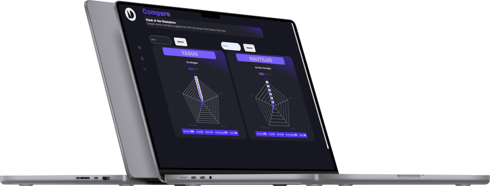

<!-- REPLACE ALL THE [WiaanDuvenhage-200307] TEXT WITH YOUR GITHUB PROFILE NAME & THE [loldata] WITH THE NAME OF YOUR GITHUB PROJECT -->

<!-- Repository Information & Links-->
<br />


<!-- HEADER SECTION -->
<h5 align="center" style="padding:0;margin:0;">Wiaan Duvenhage</h5>
<h5 align="center" style="padding:0;margin:0;">200307</h5>
<h6 align="center">DV200 - Term 1</h6>
</br>
<p align="center">

  <a href="https://github.com/WiaanDuvenhage-200307/loldata">
    
  </a>
  
  <h3 align="center">LOLDATA</h3>

  <p align="center">
    A React project built using React, Node.js & Chart.js 2 and an API of my choice. <br>
    
   <br />
   <br />
   <a href="https://youtu.be/y_ktyHSNhaM">View Demo</a>
    ·
    <a href="https://github.com/WiaanDuvenhage-200307/loldata/issues">Report Bug</a>
    ·
    <a href="https://github.com/WiaanDuvenhage-200307/loldata/issues">Request Feature</a>
</p>
<!-- TABLE OF CONTENTS -->

## Table of Contents

- [About the Project](#about-the-project)
  - [Project Description](#project-description)
  - [Built With](#built-with)
- [Getting Started](#getting-started)
  - [Prerequisites](#prerequisites)
  - [How to install](#how-to-install)
- [Features and Functionality](#features-and-functionality)
- [Concept Process](#concept-process)
  - [Ideation](#ideation)
  - [Wireframes](#wireframes)
- [Development Process](#development-process)
  - [Implementation Process](#implementation-process)
    - [Highlights](#highlights)
    - [Challenges](#challenges)
  - [Future Implementation](#peer-reviews)
- [Final Outcome](#final-outcome)
  - [Mockups](#mockups)
  - [Video Demonstration](#video-demonstration)
- [Conclusion](#conclusion)
- [License](#license)
- [Contact](#contact)
- [Acknowledgements](#acknowledgements)

<!--PROJECT DESCRIPTION-->

## About the Project

<!-- header image of project -->


### Project Description

Welcome to loldata, a cool project I built using React, Node.js, chart.js 2 and a League of Legends API that I got from sportsdata.io. View the documentation <a href="https://sportsdata.io/developers/api-documentation/lol">here</a> .

### Built With

- [React](https://reactjs.org/)
- [Chart.js 2](https://www.chartjs.org/)
- [JavaScript](https://www.javascript.com/)
- [Node.js](https://nodejs.org/en/)
- [League of Legends Sportsdata.io API](https://sportsdata.io/)

<!-- GETTING STARTED -->
<!-- Make sure to add appropriate information about what prerequesite technologies the user would need and also the steps to install your project on their own mashines -->

## Getting Started

The following instructions will get you a copy of the project up and running on your local machine for development and testing purposes.

### Installation

Here are a couple of ways to clone this repo:

1.  GitHub Desktop </br>
    Enter `https://github.com/WiaanDuvenhage-200307/loldata.git` into the URL field and press the `Clone` button.

2.  Clone Repository </br>
    Run the following in the command-line to clone the project:

    ```sh
    git clone https://github.com/WiaanDuvenhage-200307/loldata.git
    ```

        Open `Software` and select `File | Open...` from the menu. Select cloned directory and press `Open` button

3.  Install Dependencies </br>
    Run the following in the command-line to install all the required dependencies:

    ```sh
    npm install axios
    ```

    ```sh
    npm install react-chartjs-2 --save
    ```

    ```sh
    npm install react-router-dom
    ```

    ```sh
    npm install react-browser-router --save
    ```

4.  An API key IS required for this app to work. You would need to register on Sportsdata.io first <a href="https://sportsdata.io/user/register">here</a>.

5.  Import Font Awesome Library
    In your component you want to use the font awesome icons use this `import`

```sh
import "https://kit.fontawesome.com/3d7d8906d0.js"
```

<!-- FEATURES AND FUNCTIONALITY-->
<!-- You can add the links to all of your imagery at the bottom of the file as references -->

## Features and Functionality

<!-- note how you can use your gitHub link. Just make a path to your assets folder -->

### Dashboard Features & Functionality!


Using the API and chart.js, I populated a doughnut chart, which displays how many players play in each role. Next up using also the API and chart.js, I populated a polar chart which will display how many players originate from country x and lastly additional information will be given like how many pro players there are, how many teams are there currently and how many items are in the game.

### Compare Page Features & Functionality


Using the API & chart.js I populated a radar chart. You need to type in the champions name, whether it is uppercase or lowercase, and it will append their statistics to the radar chart and give contextualised details on the bottom of each chart.

### Timeline Page Features & Functionality


Again, using the API & chart.js I generated a timeline chart which will display the previous and current players, playing for the team and for how long they have been playing. When the user clicks on the dropdown they can select a team and then the team's players will be appended to the chart on the y-axis and the years of when they played will be on the x-axis.

<!-- CONCEPT PROCESS -->
<!-- Briefly explain your concept ideation process -->
<!-- here you will add things like wireframing, data structure planning, anything that shows your process. You need to include images-->

## Concept Process

For my conceptual process, I took a look at websites such as Behance, Pinterest and Siteinspire. I also watched a few Rick and Morty episodes and took a look at the colors and played around with them in Figma and looked at sites like cooolors.co to have a sense of a good color palette.

### Wireframes

  

## Development Process

The `Development Process` is the technical implementations and functionality done in the frontend and backend of the application.

### Implementation Process

- I used React, Chart.js, Node.js and an API endpoint to create this project. I implemented component-based development instead of classes. By doing this, I will be able to easily inject and eject components and sub-components into my project, making it refactorable and reusable instead of writing up classes I have to do everytime making it tedious and redundant. I also used the `{Link}` component from the `react-router-dom` dependency to navigate to my pages without the DOM flashing.

-I also implemented a Font-Awesome icon library and used it for my navigation buttons

- I implemented the `Browser Router` and `routing` into my project to use navigate to my various components. I also implemented seperate CSS files for each component that I created. I made all these components and I injected them in my `App.js` and used `index.js`for injecting my `BrowserRouter` to navigate to my pages/components.

- For the dashboard I used React hooks like `useEffect, useState` to populate my charts and injecting `jsx` into my chart components so that I can view data from the API and see for example how many players are there per role. I wrote the data of my chart as a variable and in my `return` function I wrote `jsx` in my chart component for it to populate with API data.

- For the compare page I had the same approach, but I used the `useRef` hook as well to reference to the search button that I am typing into. Something I also did different was my entire chart component was written in the `return` function. So whenever a user types in a champion's name it will check for it in the API and if it matches it will populate the chart with the champion's name, title and their stats.

- And lastly, for the timeline page, I used the exact same concept for the compare page but instead of a search bar it is a dropdown of all the teams currently. I dynamically populated the dropdown with a `Array.map()` function and populated it with the team names from the API Data. It then checks if what the user clicks is valid and it populates the chart with the previous and current teammates of that clicked team.

#### Highlights

<!-- stipulated the highlight you experienced with the project -->

- The highlight of this project was definitely working with React and Chart.js, implementing them and seeing how components work together along with the API data to create a sleek front-end design.

-Another highlight is seeing how the API data dynamically populates with the chart's and seeing how they function.

#### Challenges

<!-- stipulated the challenges you faced with the project and why you think you faced it or how you think you'll solve it (if not solved) -->

- I struggled a lot to grasp the idea of React props, it is still something I do not fully understand but will dig into research and mini courses on the web and start learning how props really work.
- I could not figure out why my data on my timeline component would only render after I inspect the page or zoom out/in.
- I struggled with getting a final design/ color scheme going, but by help from my lecturer and tools online, I could overcome that obstacle.
- I could not implement a current time, I kept getting an error message.
- I also could not implement a preloader that loads whilst waiting for the API data to load, but it is something that I will be researching.
- Something I also found tricky with, was implementing data on the timeline page and making it work with the type of chart that I used on that page, but help from peers got me through it.

#### Above And Beyond

<!-- TODO Change this! -->

The aspects I learned outside of class time is that I made a timeline chart using a Bar chart but I managed to swap the x and y-axis around and that I managed to showcase the bar chart as a gantt chart, which is really cool!

### Future Implementation

<!-- TODO Change this! -->

<!-- stipulate functionality and improvements that can be implemented in the future. -->

- My future implementation plannings are that I want to fix the timeline chart bug so that it will not only show the data once I zoom out or inspect the page.

- Another implementation I want to do is by making the page responsive by implementing some kind of framework like Bootstrap of Tailwind-CSS.

-I also want to make it more visually appealing by adding the image of the champion on the compare page instead of just its name, but I think I would need a better API that will give me more data to work with.

- I also want to add a "next tournament section" to the dashboard to show when is the next tournament and a countdown of it. Alongside that I want to add a "previous result" section which will show what team just played and who won.

<!-- MOCKUPS -->

## Final Outcome

### Mockups

<!-- TODO Change this -->


<br>

<!-- VIDEO DEMONSTRATION -->

### Video Demonstration

<!-- TODO Change this -->

To see a run through of the application, click below:

[View Demonstration](https://youtu.be/y_ktyHSNhaM)

See the [open issues](https://github.com/WiaanDuvenhage-200307/loldata/issues) for a list of proposed features (and known issues).

<!-- AUTHORS -->

## Authors

- **Wiaan Duvenhage** - [Wiaan Duvenhage](https://github.com/WiaanDuvenhage-200307)

<!-- LICENSE -->

## License

Distributed under the MIT License. See `LICENSE` for more information.\

<!-- LICENSE -->

## Contact

- **Wiaan Duvenhage** - [wiaanduvenhage.dev@gmail.com](mailto:wiaanduvenhage.dev@gmail.com) - [@double.u.dee.designs](https://www.instagram.com/double.u.dee.designs/)
- **Project Link** - https://github.com/WiaanDuvenhage-200307/loldata

<!-- ACKNOWLEDGEMENTS -->

## Acknowledgements

<!-- all resources that you used and Acknowledgements here -->
<!-- TODO Change this -->

- [League of Legends API Docs](https://sportsdata.io/developers/api-documentation/lol)
- [Stack Overflow](https://stackoverflow.com/)
- [Make my Download](https://makemydownload.com/635c1e8667630008)
- [removebg](https://www.remove.bg/)
- [Font Awesome](https://fontawesome.com/)
- [Cooolors](https://coolors.co/)
- [Figma](https://www.figma.com/)
